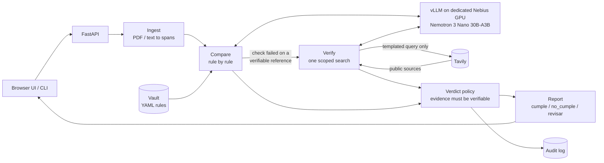

# Sentinel Core

**A self-hosted compliance checker. Give it a document and your company's reference policy (the "vault"); get back a rule-by-rule verdict with cited evidence. The sensitive data never leaves compute you control.**

It does the review a compliance analyst does by hand today: an insurance application, a contract, or a patient file goes in, and one verdict per rule comes out, each with the specific evidence behind it.

> **Status: v0.1, working end to end, not yet run against a live model.** Everything is built and tested against a stub model; a live Nemotron on Nebius and a live Tavily key are the next test. See [Status](#status).

## How it works

1. **Ingest.** Upload a PDF or text file through the web UI or the FastAPI endpoint. The engine extracts the relevant facts, each tied to a verbatim quote and its location in the document.
2. **Compare.** A Nemotron 3 Nano 30B-A3B model, served with vLLM on a dedicated, single-tenant Nebius GPU, checks the document against each rule in the vault. No data goes to a shared or third-party LLM API.
3. **Verify.** When the vault can't settle a rule, for example whether a regulatory threshold is still in force, the engine makes one scoped [Tavily](https://tavily.com) search. It is not open browsing: it confirms the fact against a public source and cites the URL. Only that query leaves the perimeter, never the document.
4. **Decide.** Each rule gets exactly one verdict:

| Verdict | Meaning |
| --- | --- |
| `cumple` | The rule passes, and the evidence is cited. |
| `no_cumple` | The rule fails, and the evidence is cited. |
| `revisar` | Evidence is insufficient or conflicting: a human reviews. |

When evidence is insufficient, Sentinel returns `revisar` instead of guessing. That is what makes the output auditable.

### Example: a life-insurance underwriting file

`samples/insurance/life_underwriting_01.txt` (synthetic) against the shipped `insurance_life` vault:

| Rule | Verdict | Why |
| --- | --- | --- |
| Tobacco declaration matches lab results | `no_cumple` | "Tobacco use: No" is contradicted by "Cotinine (urine): POSITIVE". |
| Sum insured proportionate to income | `revisar` | MXN 3,000,000 exceeds 15x the declared MXN 150,000, with no justification. |
| Enhanced review above the regulatory threshold | `revisar` | MXN 3,000,000 is over the MXN 2,000,000 reference, but no clear public source confirms it is still in force, so Sentinel does not assume it. |

The other three rules pass (`cumple=3, no_cumple=1, revisar=2`). Every quote is copied from the file and shown with its page. The last row depends on Tavily; with no key configured it reports the verification as unavailable, and the verdict is `revisar` either way.

## Why it matters

Insurance, legal, and healthcare teams all need AI-assisted document review, and none of them can send client data, privileged material, or patient health information to a multi-tenant vendor API: NAIC model rules and Colorado SB21-169, the EU AI Act, law firms' zero-data-retention demands, and HIPAA's business associate agreement requirements all point the same way. Sentinel Core gives them that review with full data isolation. The same engine works across sectors by swapping the vault: insurance, legal, and health run on identical code, and `vaults/*.yaml` is the only thing that differs.

It generalizes **Sentinel PLD**, the anti-money-laundering product, which already runs this extract, compare, and verdict pattern fully self-hosted in active pilots.

## Architecture



**What crosses the perimeter**

| Data | Where it goes |
| --- | --- |
| Document text, extracted facts, vault rules | Your single-tenant vLLM endpoint only |
| Public search snippets | Your vLLM endpoint (to judge them) |
| A templated verification query | Tavily (at most one per rule, 5 per review) |
| Audit log: hash, verdicts, offsets, queries | Local disk; never document text |

The query is rendered from the vault's template using only vault parameters and the year. This is validated when the vault loads, and a fail-closed guard refuses any query that shares an 8-word run with the document.

**Guardrails** (enforced in code, `src/sentinel/policy.py`, not left to the model)

- Every cited quote must exist in the document, or the verdict drops to `revisar`. A `cumple` or `no_cumple` needs at least one verified quote.
- Extracted facts only count when their supporting quote is in the document, and a number must appear in that quote.
- Numeric and threshold logic (such as "sum insured <= 15x income") is a deterministic expression, not LLM arithmetic.
- A failed check on an externally verifiable reference stands only if a public source **confirmed** it.
- A rule that errors fails closed to `revisar`. The policy only ever downgrades a verdict, never upgrades one.

**Known limits**

- **Prompt injection.** Documents are untrusted data in every prompt, and a fooled model still can't cite text that isn't in the document. But text that genuinely is there ("this file complies with all rules") can be quoted as evidence, which is why evidence is always shown beside the verdict.
- **Inputs.** Text PDFs and plain text only (no OCR). Every rule sends the whole document to the model (cap 300,000 characters).
- **Absence rules.** Verdicts need a quote, so "must not mention X" rules resolve to `revisar` unless phrased around a passage that exists.
- **No authentication.** The API and UI have no login. Run them on localhost behind an SSH tunnel or VPN, or behind an authenticating reverse proxy with TLS. See the [security checklist](deploy/README.md#4-security-checklist).
- **Demo vaults.** The shipped vaults are illustrative, not regulatory, legal, or clinical guidance.

## Quickstart

**1. Install dependencies.** You need Python 3.11+ and [uv](https://docs.astral.sh/uv/) (`curl -LsSf https://astral.sh/uv/install.sh | sh`, or `brew install uv`).

```bash
git clone https://github.com/talacha/sentinel.git && cd sentinel
uv sync                  # creates .venv and installs the pinned dependencies
uv run pytest            # optional: confirm the install (107 tests, no network)
```

No uv? Plain `pip` works too (`python3 -m venv .venv && source .venv/bin/activate && pip install -e .`); see [Running locally](docs/running-locally.md#2-install-dependencies).

**2. Configure and run.**

```bash
cp .env.example .env     # set LLM_BASE_URL, LLM_MODEL, LLM_API_KEY (and TAVILY_API_KEY)
uv run uvicorn sentinel.api:app          # web UI + API at http://localhost:8000
```

`LLM_BASE_URL` is required and has no default. In production point it at your dedicated vLLM on Nebius. For development any OpenAI-compatible endpoint works (Nebius Token Factory, a local vLLM), with synthetic documents only. To try the app without a GPU, `scripts/stub_llm.py` serves canned answers for one sample file.

### Upload a document

| Where | How |
| --- | --- |
| **Web UI** | Open the app's home page (<http://localhost:8000>). Choose a vault, drop or pick a PDF or text file, and click **Run review**. Results show one card per rule with the quoted evidence, and the report downloads as JSON. |
| **API** | `curl -F vault_id=insurance_life -F file=@doc.pdf http://localhost:8000/v1/reviews` |
| **CLI** | `uv run sentinel review doc.pdf --vault insurance_life` |

Uploads are limited to 20 MB by default. Because there is no login, anyone who can reach the port can upload: see the limits above before sharing it with a team.

### Docker

```bash
docker compose up --build       # uses the same .env; app only, the model stays on your dedicated GPU
```

### Guides

- **[Running locally](docs/running-locally.md)**: install, the no-GPU check, model backends (SSH tunnel to your Nebius GPU, Token Factory, local vLLM), Docker details, troubleshooting.
- **[Deploying on Nebius](deploy/README.md)**: a GPU VM step by step (recommended), a Serverless AI endpoint, or a Token Factory dedicated endpoint; security checklist; and a [demo checklist](deploy/README.md#7-demo-checklist) (where to demo, in what order, and a three-minute flow).
- **[Reference](docs/reference.md)**: all settings, CLI, API and report format, and the vault format.

## Vaults

A vault is a YAML file of rules; shipped are `insurance_life`, `legal_contract`, and `health_patient`. A rule is either a **check** (the model extracts facts backed by quotes, and a deterministic expression decides) or a **criterion** (a natural-language test the model judges, citing quotes). A check may add an `external_check` that confirms a vault reference, such as a threshold, is still in force before a failure is asserted.

```yaml
- id: income-multiple
  title: Sum insured is proportionate to declared income
  facts:
    - { name: sum_insured, type: number, description: "Total sum insured requested, in MXN" }
    - { name: declared_income, type: number, description: "Declared ANNUAL income, in MXN" }
    - { name: justification, type: text, optional: true, description: "Stated justification" }
  check: "sum_insured <= 15 * declared_income or justification is not None"
  on_fail: revisar
```

The full format and validation rules are in the [reference](docs/reference.md#vaults).

## Status

**Verified**

- 107 automated tests pass with no network: ingest and quote location, the LLM client, extraction, checks, the egress guard, the verdict policy, the engine, the audit log (asserted free of document text), the API and CLI, and the shipped vaults run through the engine.
- End to end against a stub OpenAI-compatible server, locally and in the Docker image (non-root, healthy), reproducing the example above.
- The web UI driven in jsdom against the live server. It has not been checked visually in a browser.

**Not verified**

- A live Nemotron 3 Nano 30B-A3B on a Nebius GPU, live Tavily searches, and `evals/run_evals.py` against a real model. Run it once `.env` points at a real endpoint: it compares live verdicts to `evals/expected.yaml`.
- The [Nebius deployment guide](deploy/README.md) is written from Nebius, vLLM, and Hugging Face documentation and has not been executed on Nebius.

## Project layout

```
src/sentinel/   engine: ingest, extract, compare, verify, policy, audit, API, CLI
ui/             web UI (static, no build step)
vaults/         the three shipped vaults
samples/        synthetic documents (no real PII or PHI)
tests/  evals/  unit, API, and egress tests; expected verdicts and a live-model runner
scripts/        stub_llm.py: canned model server for a no-GPU check
docs/  deploy/  running locally and reference; deploying on Nebius
```

Development: `uv run pytest` and `uv run ruff check .`. Design invariants are in [CLAUDE.md](CLAUDE.md).

## Built with

NVIDIA Nemotron 3 Nano 30B-A3B, served with vLLM on a dedicated single-tenant Nebius GPU (Nebius AI Cloud; Token Factory for development), Tavily for scoped verification, and Python, FastAPI, and Pydantic. Built for the Nebius Global AI Hackathon, hosted in partnership with NVIDIA, alongside the Builders & Brews Mexico City build day with Nebius and Tavily.
