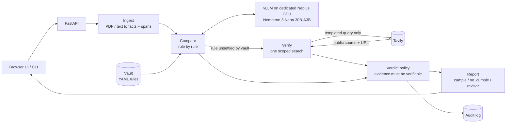

# Sentinel Core

**A self-hosted compliance checker. Give it a document and your company's reference policy; get back a rule-by-rule verdict with cited evidence. The sensitive data never leaves compute you control.**

> **Status: in development.** This README describes the target design. Sections marked _(planned)_ are not built yet and will be updated with verified commands as each milestone lands.

Sentinel Core does the review a compliance analyst does by hand today. You upload a document (an insurance application, a contract, a patient file) and point it at your company's reference policy, the **vault**. It returns one verdict per rule, each with the specific evidence behind it.

## How it works

1. **Ingest.** Upload a PDF or text file through a small web UI or the FastAPI endpoint. The engine extracts the relevant facts, each tied to a verbatim quote and its location in the document.
2. **Compare.** A Nemotron 3 Nano 30B-A3B model, served with vLLM on a dedicated, single-tenant Nebius GPU, checks the document against each rule in the vault. No data goes to a shared or third-party LLM API.
3. **Verify.** When the vault can't settle a rule, for example whether a regulatory threshold is still in force, the engine makes one scoped [Tavily](https://tavily.com) search. It is not open browsing. It confirms the fact against a public source and cites the URL. Only that query leaves the perimeter, never the document.
4. **Decide.** Each rule gets exactly one verdict:

| Verdict     | Meaning                                                     |
| ----------- | ----------------------------------------------------------- |
| `cumple`    | The rule passes, and the evidence is cited.                 |
| `no_cumple` | The rule fails, and the evidence is cited.                  |
| `revisar`   | Evidence is insufficient or conflicting: a human reviews.   |

When evidence is insufficient, Sentinel returns `revisar` instead of guessing. That is what makes the output auditable.

## Example: a life-insurance underwriting file

- Flags a "non-smoker" declaration contradicted by a positive cotinine test: **`no_cumple`**.
- Flags a $3M sum insured that exceeds 15x declared income without justification: **`revisar`**.
- Checks online for a $2M MXN regulatory threshold, finds no clear source, and marks it **`revisar`** rather than assuming the threshold still applies.

An abbreviated report _(planned output shape)_:

```json
{
  "vault": "insurance_life",
  "document_sha256": "9f2c…",
  "results": [
    {
      "rule_id": "smoker-declaration",
      "verdict": "no_cumple",
      "rationale": "Applicant declares non-smoker, but the lab panel reports a positive cotinine result.",
      "evidence": [
        { "quote": "Tobacco use: No", "page": 2 },
        { "quote": "Cotinine (urine): POSITIVE", "page": 5 }
      ]
    },
    {
      "rule_id": "income-multiple",
      "verdict": "revisar",
      "rationale": "Sum insured of $3,000,000 exceeds 15x declared income ($150,000) and no justification is present.",
      "evidence": [
        { "quote": "Sum insured: $3,000,000", "page": 1 },
        { "quote": "Annual income: $150,000", "page": 1 }
      ]
    },
    {
      "rule_id": "mxn-threshold",
      "verdict": "revisar",
      "rationale": "No clear public source confirms the $2M MXN threshold is still in force.",
      "evidence": [],
      "external": {
        "query": "current regulatory threshold life insurance underwriting Mexico 2026",
        "sources": ["https://example.gob.mx/…"]
      }
    }
  ]
}
```

## Why it matters

Insurance, legal, and healthcare teams all need AI-assisted document review. None of them can send client data, privileged material, or patient health information to a multi-tenant vendor API, because of:

- NAIC model rules and Colorado SB21-169 for insurers,
- the EU AI Act,
- zero-data-retention demands from law firms,
- HIPAA's business associate agreement requirements.

Sentinel Core gives them that review with full data isolation. The same engine works across sectors by swapping the vault: insurance, legal, and health run on identical code.

It generalizes **Sentinel PLD**, the author's anti-money-laundering product, which already runs this extract, compare, and verdict pattern fully self-hosted in active pilots.

## Architecture _(planned)_



### What crosses the perimeter

| Data                               | Where it goes                                   |
| ---------------------------------- | ----------------------------------------------- |
| Document text, extracted facts     | Your single-tenant vLLM endpoint only           |
| Vault rules                        | Your vLLM endpoint only                         |
| A templated verification query     | Tavily (one per unsettled rule, at most)        |
| Audit log (hash, verdicts, queries) | Local disk; never contains document text        |

The outbound query is built only from the vault's query template and whitelisted fields (rule metadata, jurisdiction, year). It is never built from document content, and every query is recorded in the audit log.

### Guardrails

Auditability is enforced in code, not left to the model:

- Every cited quote must be found verbatim in the source document, or the verdict is downgraded to `revisar`.
- Missing required facts, malformed model output, or an unclear external source all resolve to `revisar`.
- Numeric and threshold checks (such as "sum insured <= 15x income") run as deterministic expressions, not LLM arithmetic.

## Vaults _(planned)_

A vault is a YAML file of rules. The engine is domain-agnostic, so swapping the vault changes the sector with no code changes. Three vaults are planned: `insurance_life`, `legal_contract`, and `health_patient`.

```yaml
id: insurance_life
title: Life insurance underwriting
rules:
  - id: income-multiple
    title: Sum insured is proportionate to income
    facts:
      - { name: sum_insured, type: money, description: "Total sum insured requested" }
      - { name: declared_income, type: money, description: "Applicant's declared annual income" }
      - { name: justification, type: text, optional: true, description: "Any stated justification for a high sum insured" }
    check: "sum_insured <= 15 * declared_income or justification is not None"
    on_fail: revisar

  - id: mxn-threshold
    title: Regulatory threshold in force
    external_check:
      query_template: "current regulatory threshold life insurance underwriting {jurisdiction} {year}"
      allowed_domains: ["gob.mx"]
    on_fail: revisar
```

## Quickstart _(planned)_

```bash
uv sync
cp .env.example .env            # set LLM_BASE_URL, LLM_MODEL, LLM_API_KEY, TAVILY_API_KEY
uv run sentinel review samples/insurance/life_underwriting_01.txt --vault insurance_life
uv run uvicorn sentinel.api:app # web UI at http://localhost:8000
```

`LLM_BASE_URL` is required and has no default to a public API. In production, point it at your dedicated vLLM endpoint on Nebius. For development, any OpenAI-compatible endpoint works, such as Nebius Token Factory or a local vLLM.

## Project layout _(planned)_

```
src/sentinel/   engine: ingest, extract, compare, verify, policy, audit, API, CLI
ui/             static web UI (no build step)
vaults/         insurance_life.yaml, legal_contract.yaml, health_patient.yaml
samples/        synthetic documents, one per vault (no real PII or PHI)
tests/          unit, API, and egress tests
evals/          expected verdicts per sample document
deploy/         serving Nemotron 3 Nano on vLLM on Nebius
```

## Built with

- **Model:** NVIDIA Nemotron 3 Nano 30B-A3B
- **Inference:** vLLM on a dedicated single-tenant Nebius GPU (Nebius AI Cloud; Nebius Token Factory for development)
- **Verification:** Tavily scoped search
- **App:** Python, FastAPI, Pydantic

Built for the Nebius Global AI Hackathon, hosted in partnership with NVIDIA, alongside the Builders & Brews Mexico City build day with Nebius and Tavily.
