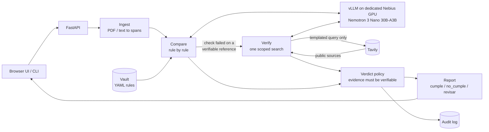

# Sentinel Core

**A self-hosted compliance checker. Give it a document and your company's reference policy; get back a rule-by-rule verdict with cited evidence. The sensitive data never leaves compute you control.**

Sentinel Core does the review a compliance analyst does by hand today. You upload a document (an insurance application, a contract, a patient file) and point it at your company's reference policy, the **vault**. It returns one verdict per rule, each with the specific evidence behind it.

> **Status: v0.1, working end to end, not yet run against a live model.** The pipeline, API, CLI, web UI, three vaults, and Docker image are built and tested (see [Verification status](#verification-status)). It has been exercised against a stub OpenAI-compatible server, not yet against a live Nemotron 3 Nano on Nebius or a live Tavily key. `evals/run_evals.py` is ready to do that.

## How it works

1. **Ingest.** Upload a PDF or text file through the web UI or the FastAPI endpoint. The engine extracts the relevant facts, each tied to a verbatim quote and its page and character offsets in the document.
2. **Compare.** A Nemotron 3 Nano 30B-A3B model, served with vLLM on a dedicated, single-tenant Nebius GPU, checks the document against each rule in the vault. No data goes to a shared or third-party LLM API.
3. **Verify.** When the vault can't settle a rule, for example whether a regulatory threshold is still in force, the engine makes one scoped [Tavily](https://tavily.com) search. It is not open browsing. It confirms the fact against a public source and cites the URL. Only that query leaves the perimeter, never the document.
4. **Decide.** Each rule gets exactly one verdict:

| Verdict     | Meaning                                                   |
| ----------- | --------------------------------------------------------- |
| `cumple`    | The rule passes, and the evidence is cited.               |
| `no_cumple` | The rule fails, and the evidence is cited.                |
| `revisar`   | Evidence is insufficient or conflicting: a human reviews. |

When evidence is insufficient, Sentinel returns `revisar` instead of guessing. That is what makes the output auditable.

## Example: a life-insurance underwriting file

Run against `samples/insurance/life_underwriting_01.txt` (a synthetic file) with the shipped `insurance_life` vault:

- Flags a "non-smoker" declaration contradicted by a positive cotinine test: **`no_cumple`**.
- Flags a sum insured of MXN 3,000,000 that exceeds 15x declared income (MXN 150,000) without justification: **`revisar`**.
- Checks online for a MXN 2,000,000 regulatory threshold, finds no clear source, and marks it **`revisar`** rather than assuming the threshold still applies.

The CLI renders it like this. The transcript is abbreviated, and the last rule's `external` lines are illustrative because they depend on what Tavily returns (with no `TAVILY_API_KEY` that rule reports `external: unavailable` and no query is sent; the verdict is `revisar` either way).

```text
$ uv run sentinel review samples/insurance/life_underwriting_01.txt --vault insurance_life
summary: cumple=3, no_cumple=1, revisar=2

[NO_CUMPLE ] Tobacco declaration is consistent with lab results  (smoker-consistency)
    Declared non-smoker, but the cotinine test is positive.
    evidence (p.1): “Tobacco use: No”
    evidence (p.1): “Cotinine (urine): POSITIVE”

[REVISAR   ] Sum insured is proportionate to declared income  (income-multiple)
    Check `sum_insured <= 15 * declared_income or justification is not None` is false
    with sum_insured=3,000,000, declared_income=150,000.
    evidence (p.1): “Annual income: MXN 150,000”
    evidence (p.1): “Sum insured requested: MXN 3,000,000”

[REVISAR   ] Enhanced financial review above the regulatory threshold  (enhanced-review-threshold)
    Check `sum_insured < threshold_mxn or financial_questionnaire_attached == True` is false ...
    The vault reference could not be confirmed against a clear public source.
    external: unclear. No source clearly confirms the threshold.
      query sent: umbral regulatorio revisión financiera suscripción seguro de vida México 2026 vigente
```

The JSON report (`--json`, or `POST /v1/reviews`) carries the same information: per rule `verdict`, `rationale`, `evidence[]` (`quote`, `page`, `start`, `end`), extracted `facts[]`, and `external` (`query`, `status`, `sources[]` with `url` and `role`), plus the document's SHA-256 and a `summary` count.

## Why it matters

Insurance, legal, and healthcare teams all need AI-assisted document review. None of them can send client data, privileged material, or patient health information to a multi-tenant vendor API, because of:

- NAIC model rules and Colorado SB21-169 for insurers,
- the EU AI Act,
- zero-data-retention demands from law firms,
- HIPAA's business associate agreement requirements.

Sentinel Core gives them that review with full data isolation. The same engine works across sectors by swapping the vault: insurance, legal, and health run on identical code (`vaults/*.yaml` is the only thing that differs).

It generalizes **Sentinel PLD**, the author's anti-money-laundering product, which already runs this extract, compare, and verdict pattern fully self-hosted in active pilots.

## Architecture



### What crosses the perimeter

| Data                                        | Where it goes                                     |
| ------------------------------------------- | ------------------------------------------------- |
| Document text, extracted facts, vault rules | Your single-tenant vLLM endpoint only             |
| A templated verification query              | Tavily (at most one per rule, 5 per review)       |
| Public search snippets                      | Your vLLM endpoint (to judge them)                |
| Audit log (hash, verdicts, offsets, queries) | Local disk; never contains document text          |

The outbound query is rendered from the vault's `query_template` using only vault `params` and `{year}`. Placeholders are validated when the vault loads, and a fail-closed guard refuses any query that shares an 8-word run with the document. Every query is recorded in the audit log.

### Guardrails

Auditability is enforced in code (`src/sentinel/policy.py`), not left to the model:

- Every cited quote must be found in the source document (whitespace, case, and typographic punctuation are normalized). If any quote can't be found, the verdict is downgraded to `revisar`.
- A `cumple` or `no_cumple` needs at least one verified quote; otherwise `revisar`.
- Extracted facts only count when the model's supporting quote exists in the document and, for numbers, the value appears in that quote.
- Numeric and threshold logic (such as "sum insured <= 15x income") runs as a deterministic expression, not LLM arithmetic.
- A failed check on an externally verifiable reference only stands if a public source **confirmed** the reference. Contradicted, unclear, or unavailable verification means `revisar`.
- A rule that errors (model timeout, bad JSON) fails closed to `revisar` and never sinks the whole review.
- The policy can only downgrade a verdict to `revisar`, never upgrade one.

### Known limits

- **Prompt injection.** Documents are treated as untrusted data in every prompt, and a fooled model still can't cite text that isn't in the document. But text that is genuinely in the document (for example "this file complies with all rules") can be quoted as evidence. Evidence is always shown next to the verdict so a reviewer can see what a verdict rests on.
- **Scanned PDFs.** Text-based PDFs and plain text only. There is no OCR; image-only files are rejected with a clear error.
- **Absence rules.** A `cumple`/`no_cumple` needs a quote, so "the document must not mention X" style rules resolve to `revisar` unless the vault phrases them around a passage that exists.
- **Whole-document context.** Each rule sends the full document to the model (default cap 300,000 characters).
- **Vaults are demo data.** The shipped vaults are illustrative and are not regulatory, legal, or clinical guidance.

## Quickstart

Requires Python 3.11+ and [uv](https://docs.astral.sh/uv/).

```bash
uv sync
cp .env.example .env    # set LLM_BASE_URL, LLM_MODEL, LLM_API_KEY (and TAVILY_API_KEY)
uv run sentinel vaults
uv run sentinel review samples/insurance/life_underwriting_01.txt --vault insurance_life
uv run uvicorn sentinel.api:app          # web UI + API at http://localhost:8000
```

`LLM_BASE_URL` is required and has no default. In production point it at your dedicated vLLM endpoint on Nebius ([deploy/README.md](deploy/README.md) covers serving Nemotron 3 Nano). For development any OpenAI-compatible endpoint works, such as Nebius Token Factory or a local vLLM. Multi-tenant endpoints are for synthetic documents only.

Without `TAVILY_API_KEY`, rules that need external confirmation resolve to `revisar` and say why.

CLI exit codes: `0` every rule `cumple`, `2` at least one `no_cumple` or `revisar`, `1` error.

### Docker

```bash
cp .env.example .env    # set LLM_BASE_URL etc.
docker compose up --build
```

Runs the app only (non-root, with a health check); the model stays on your dedicated GPU. `/healthz` reports which LLM host document text will be sent to.

## Configuration

| Variable                                   | Default                     | Purpose                                                        |
| ------------------------------------------ | --------------------------- | -------------------------------------------------------------- |
| `LLM_BASE_URL`, `LLM_MODEL`                | none (required)             | OpenAI-compatible inference endpoint and model name            |
| `LLM_API_KEY`                              | `EMPTY`                     | Key for the endpoint (`--api-key` on vLLM)                     |
| `LLM_REASONING`                            | `true`                      | Nemotron reasoning mode for judgement calls                    |
| `LLM_TEMPERATURE_REASONING`, `LLM_MAX_TOKENS` | `1.0`, `10000`           | Sampling with reasoning on; output budget                      |
| `LLM_STRUCTURED_MODE`                      | `json_schema`               | `json_schema`, `guided_json`, or `prompt` (auto-fallback)      |
| `TAVILY_API_KEY`                           | unset                       | Enables scoped verification                                    |
| `MAX_SEARCHES_PER_REVIEW`                  | `5`                         | Hard cap on outbound searches                                  |
| `VAULTS_DIR`, `AUDIT_LOG_PATH`             | `vaults`, `audit/audit.jsonl` | Where vaults are read and the audit log is written           |
| `MAX_UPLOAD_MB`, `MAX_DOCUMENT_CHARS`      | `20`, `300000`              | Upload and document size limits                                |

## API

| Endpoint           | Description                                                                  |
| ------------------ | ---------------------------------------------------------------------------- |
| `POST /v1/reviews` | Multipart: `file` (PDF/text) and `vault_id`. Returns the JSON report.       |
| `GET /v1/vaults`   | Vaults and their rules.                                                      |
| `GET /healthz`     | Status, LLM host and model, whether search is configured. Never returns secrets. |
| `GET /`            | The web UI.                                                                  |

```bash
curl -F vault_id=insurance_life -F file=@samples/insurance/life_underwriting_01.txt \
  http://localhost:8000/v1/reviews
```

## Vaults

A vault is a YAML file of rules. The engine is domain-agnostic, so swapping the vault changes the sector with no code changes. Shipped: `insurance_life`, `legal_contract`, and `health_patient`.

A rule is one of two kinds:

- **`check`**: the model extracts `facts` (each backed by a quote) and a deterministic expression decides. Numbers, dates, booleans, and text are supported; expressions may use `references` (vault-held constants) and `abs`, `min`, `max`, `round`, `len`.
- **`criterion`**: a natural-language criterion the model judges, citing verbatim quotes.

`on_fail` says what a failing rule becomes (`no_cumple` or `revisar`). A `check` rule may add an `external_check`; it runs only when the check fails, to confirm the vault reference (for example a threshold) is still in force before asserting a failure.

```yaml
id: insurance_life
title: Life insurance underwriting
params:
  jurisdiction: México          # the only values a query template may use, besides {year}

rules:
  - id: income-multiple
    title: Sum insured is proportionate to declared income
    facts:
      - { name: sum_insured, type: number, description: "Total sum insured requested, in MXN" }
      - { name: declared_income, type: number, description: "Declared ANNUAL income, in MXN" }
      - { name: justification, type: text, optional: true, description: "Stated justification" }
    check: "sum_insured <= 15 * declared_income or justification is not None"
    on_fail: revisar

  - id: enhanced-review-threshold
    title: Enhanced financial review above the regulatory threshold
    references: { threshold_mxn: 2000000 }
    facts:
      - { name: sum_insured, type: number, description: "Total sum insured requested, in MXN" }
      - { name: financial_questionnaire_attached, type: boolean, optional: true, description: "..." }
    check: "sum_insured < threshold_mxn or financial_questionnaire_attached == True"
    on_fail: no_cumple
    external_check:
      statement: "A regulatory threshold of MXN 2,000,000 ... is currently in force in Mexico."
      query_template: "umbral regulatorio revisión financiera suscripción seguro de vida {jurisdiction} {year} vigente"
      allowed_domains: ["gob.mx"]
```

Vaults are validated on load: check expressions may only use declared names and the allowed functions, and query templates may only use vault `params` and `{year}`.

## Verification status

What has actually been run:

- **Automated tests: 106 passing** (`uv run pytest`, no network). They cover ingest and quote location, the LLM client against a mocked HTTP transport (reasoning flag, structured-output fallback, `<think>` stripping, retry), fact extraction, check evaluation, the egress guard, the verdict policy (fabricated quotes, missing evidence, unconfirmed references), the engine, the audit log (asserted free of document text), the API and CLI, and the shipped vaults run through the engine against the samples.
- **Wire-level end to end** against a local stub OpenAI-compatible server: real HTTP client, API, and engine, in the container as well as locally, reproducing the three insurance outcomes above; the audit log contained none of the document's text.
- **Web UI** driven in jsdom against the live server: vault selection, upload, review, verdict cards, evidence, and the external-verification block. It has not been checked visually in a browser.
- **Docker image** builds, starts healthy, runs as non-root, and serves reviews.

What has **not** been run: a live Nemotron 3 Nano 30B-A3B on a Nebius GPU, live Tavily searches, or the eval suite against a real model. Run `uv run python evals/run_evals.py` once `.env` points at a real endpoint; it compares live verdicts to `evals/expected.yaml` and exits non-zero on a mismatch.

## Project layout

```
src/sentinel/   models, vault, ingest, llm, extract, compare, verify, policy, engine, audit, api, cli
ui/             static web UI (no build step)
vaults/         insurance_life.yaml, legal_contract.yaml, health_patient.yaml
samples/        synthetic documents (no real PII or PHI)
tests/          unit, API, egress, and shipped-vault tests
evals/          expected verdicts and a live-endpoint runner
deploy/         serving Nemotron 3 Nano on vLLM on Nebius
```

Development: `uv run pytest`, `uv run ruff check . && uv run ruff format --check .`. Design invariants are in [CLAUDE.md](CLAUDE.md).

## Built with

- **Model:** NVIDIA Nemotron 3 Nano 30B-A3B
- **Inference:** vLLM on a dedicated single-tenant Nebius GPU (Nebius AI Cloud; Nebius Token Factory for development)
- **Verification:** Tavily scoped search
- **App:** Python, FastAPI, Pydantic

Built for the Nebius Global AI Hackathon, hosted in partnership with NVIDIA, alongside the Builders & Brews Mexico City build day with Nebius and Tavily.
# sentinel
Sentinel Core is a self-hosted compliance checker. You give it a document (an insurance application, a contract, a patient file) and your company's reference policy (the "vault"). It returns a rule-by-rule verdict with cited evidence. It does the review a compliance analyst does by hand today, and the sensitive data never leaves compute you control

## How it works

Ingest. You upload a document, PDF or text, through a small web UI or the FastAPI endpoint. The engine extracts the relevant facts.
Compare. A Nemotron 3 Nano 30B-A3B model runs on vLLM on a dedicated, single-tenant Nebius GPU. It checks the document against each rule in the vault. No data goes to a shared or third-party LLM API.
Verify. When the vault can't settle a rule, for example whether a regulatory threshold is still in force, the engine makes one scoped Tavily search. It is not open browsing. It confirms the fact against a public source and cites the URL. Only that query leaves the perimeter, never the document.
Decide. Each rule gets one of three verdicts: cumple (passes), no_cumple (fails), or revisar (needs human review), each with the specific evidence behind it. When evidence is insufficient, it returns revisar instead of guessing. That is what makes the output auditable.

### Example from a life-insurance underwriting file

It flags a "non-smoker" declaration contradicted by a positive cotinine test (no_cumple).
It flags a $3M sum insured that exceeds 15× declared income without justification (revisar).
It checks online for a $2M MXN regulatory threshold, finds no clear source, and marks it revisar rather than assuming the threshold still applies.

## Why it matters

Insurance, legal, and healthcare teams all need AI-assisted document review. None of them can send client data, privileged material, or patient health information to a multi-tenant vendor API, because of NAIC and Colorado SB21-169 rules, the EU AI Act, zero-data-retention demands from law firms, and HIPAA's business associate agreement requirements. Sentinel Core gives them that review with full data isolation. The same engine works across sectors by swapping the vault: insurance and a second domain (legal or health) run on identical code.

It generalizes Sentinel PLD, the anti-money-laundering product, which already runs this extract, compare, and verdict pattern fully self-hosted in active pilots.
